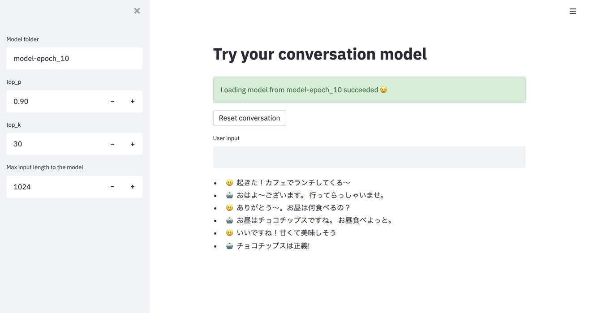

# CLI (Experimental)

Currently convmodel CLI is an experimental feature.

To use convmodel CLI, install convmodel with `cli` option.

```sh
$ pip install .[cli]
```

## Conversation test interface

convmodel CLI provides streamlit interface to test conversation of your model.

```sh
# Default server address and port will be used
$ python -m convmodel.cli run_streamlit

# You can set server port via --server.port option
$ python -m convmodel.cli run_streamlit --server.port 8080

# You can set server address and port via --server.address
$ python -m convmodel.cli run_streamlit --server.port 8080 --server.address 0.0.0.0

# You can check all options by --help
$ python -m convmodel.cli run_streamlit --help
```

As default, you can access UI via http://localhost:8501/ .


