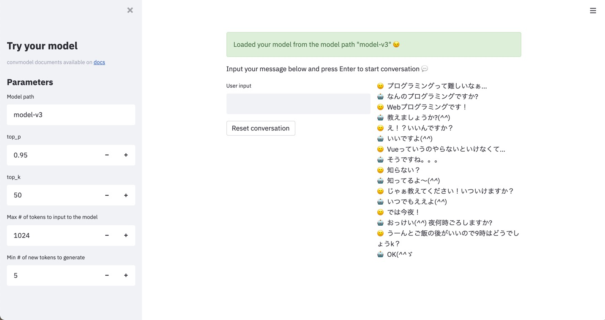

# CLI (Experimental)

Currently convmodel CLI is an experimental feature.

To use convmodel CLI, install convmodel with `cli` option.

```sh
$ pip install convmodel[cli]
```

## fit - Model training

This is a simple wrapper interface of `ConversationModel.fit` method.
You can simply run training by json config file via this interface.

All you need to do is preparing json config file. A template is prepared under `example/fit_config.json`.

```sh
$ cat example/fit_config.json
{
  "pretrained_model_or_path": "(input your pretrained model path",
  "output_path": "(input your output path)",
  "train_file": "(input yout train file)",
  "valid_file": "(input your valid file)",
  "save_best_model": false,
  "device": null,
  "lr": 1e-4,
  "warmup_steps": 10000,
  "use_amp": false,
  "epochs": 1,
  "accumulation_steps": 1,
  "show_progress_bar": true,
  "log_steps": 100,
  "shuffle_buffer_size": null,
  "batch_size": 1,
  "num_workers": 0,
  "prefetch_factor": 2,
  "seed": null,
  "deterministic": false
}
```

At least you need to edit 4 parameters.

| Parameter | Description | Example value |
| --- | --- | --- |
| pretrained_model_or_path | Pretrained model path to use | `gpt2` |
| output_path | Path to save your trained model | `model` |
| train_file | Path for training data file. The format should be Json Lines. Each line needs to contain a list of string, which are one example of conversation | `input/train.jsonl` |
| valid_file | Path for validation data file. Format is the same as `train_file`. | `input/valid.jsonl` |

One example of train/valid file is as follows.

```sh
$ head -n3 input/train.jsonl
["Hello", "Hi, how are you?", "Good, thank you, how about you?", "Good, thanks!"]
["I am hungry", "How about eating pizza?"]
["Tired...", "Let's have a break!", "Nice idea!"]
```

After preparing config json file, you can start training by `fit` CLI command.

```sh
$ python -m convmodel fit --config example/fit_config.json
```

After completing training, you can load the trained model from `output_path` for `ConversationModel`.

```py
>>> from convmodel import ConversationModel
>>> model = ConversationModel.from_pretrained("model")
```

## run_streamlit - Conversation test interface

convmodel CLI provides streamlit interface to test conversation of your model.

```sh
# Default server address and port will be used
$ python -m convmodel.cli run_streamlit

# You can set server port via --server.port option
$ python -m convmodel.cli run_streamlit --server.port 8080

# You can set server address and port via --server.address
$ python -m convmodel.cli run_streamlit --server.port 8080 --server.address 0.0.0.0

# You can check all options by --help
$ python -m convmodel.cli run_streamlit --help
```

As default, you can access UI via http://localhost:8501/ .


